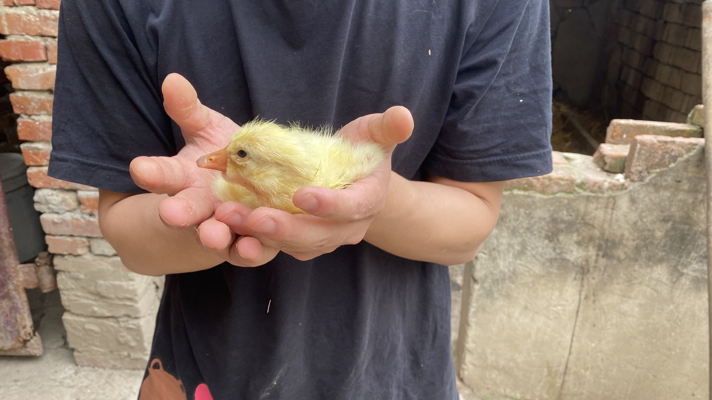

# Welcome to juzi Land 🍊

> **Life is too short to worry about little things.🧩**
> 
> **Have fun. 🏀**
> 
> **Fall in love. 🍀**
> 
> **Regret nothing, and don't let people bring you down. 😊**
> 
> **Study, think, create, and grow. 🧐**
> 
> **Teach yourself and teach others.🚀**

---

## 📚 最新文章

### 🛠️ 技术碎笔
- [TriCore上下文切换详解](tech/context_switch.md) - 深入解析嵌入式系统中的上下文切换机制
- [inline关键字应用指南](tech/inline关键字.md) - C/C++中inline关键字的正确使用姿势
- [Python虚拟环境实践](tech/venv_setting.md) - Python开发环境隔离的最佳实践

### 📖 它山之石
- [阅读推荐](others/reading.md) - 近期读过的好书分享
- [工具推荐](others/tools.md) - 提升效率的神器推荐

---

## 🌟 关于这个博客

这里是桔子的自留地，记录技术学习、生活感悟和一切有趣的事物。

**博客特点：**
- 🎯 **简洁高效** - 专注于有价值的内容
- 🔧 **技术实践** - 记录真实的技术解决方案
- 📖 **知识分享** - 分享学习过程中的收获
- 💡 **思维碰撞** - 欢迎交流不同的观点

---

## 📬 保持联系

- GitHub: [EWYan](https://github.com/EWYan)
- 博客问题反馈: [提交Issue](https://github.com/EWYan/juzidaxia/issues)

> **莫问前程，但行好事。**

