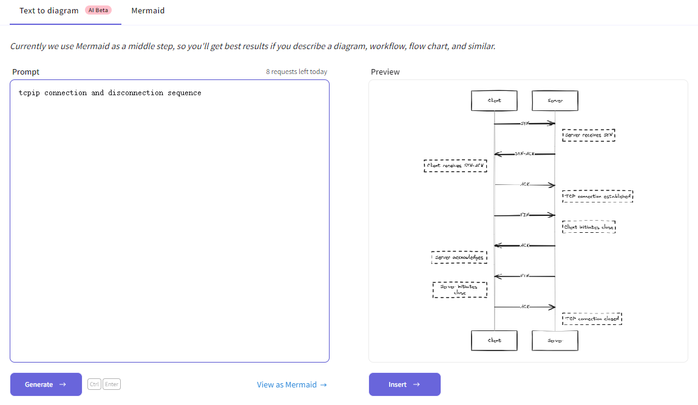

# 效率工具⌨
---
> 🪶date: 2023/12/30

## [在线编译器 COMPILER EXPLORER](https://godbolt.org/)

一个在线编译器，可以选择不同的编译器进行汇编代码生成，可以用来学习汇编语言, 
例如在网页界面的左侧输入一个c代码的函数，选择对应的编译器(如下选择ARM gcc 11.2.1(none))后，
会在页面的右侧自动生成对应的汇编代码,
```C title="c code in left block" linenums="1" hl_lines="2"
int add(int var0, int var1) {
    int sum = var0 + var1;
    return sum;
}
```
```asm title="assembly code in right block" linenums="1" hl_lines="7 8 9 10"
add(int, int):
        str     fp, [sp, #-4]!
        add     fp, sp, #0
        sub     sp, sp, #20
        str     r0, [fp, #-16]
        str     r1, [fp, #-20]
        ldr     r2, [fp, #-16]
        ldr     r3, [fp, #-20]
        add     r3, r2, r3
        str     r3, [fp, #-8]
        ldr     r3, [fp, #-8]
        mov     r0, r3
        add     sp, fp, #0
        ldr     fp, [sp], #4
        bx      lr
```

## [手绘风格作图 Excalidraw](https://excalidraw.com/)
- 可以实现协同作图
- 可以使用一段描述自动生成简图，例如



## [在线流程图绘制 draw.io](https://app.diagrams.net/)


## [远程办公软件 Parsec](https://parsec.app/)

---
