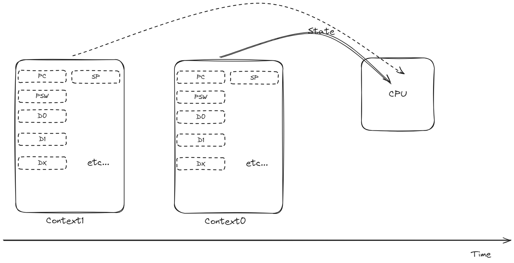
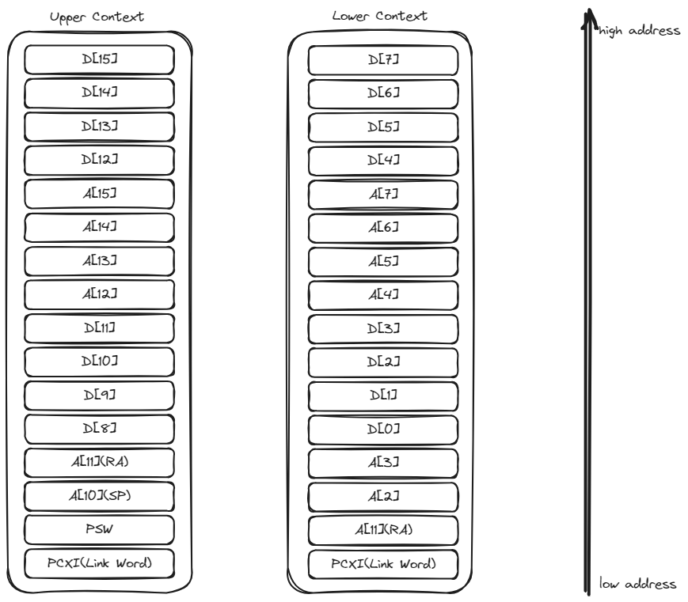
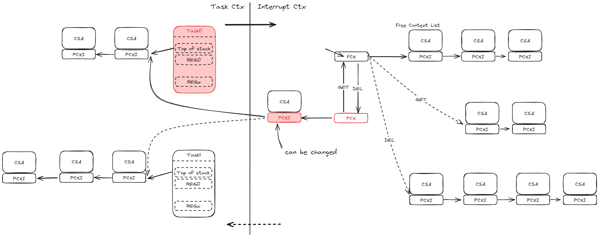

# Tricore Task Switch机制
---
> 🪶date: 2023/12/23

## 任务
在RTOS中，一个任务包含了一系列的状态，通常使用上下文（Context）来定义一个任务，上下文通常包含一些列CPU寄存器某一时刻的一个状态（Snap Shoot), 例如当前CPU上正在执行的任务是Task0，意思是在说当前CPU所处的状态是在Task0的上下文中；

通常情况下，CPU在切换任务时，将当前上下文保存到即将被切出的任务堆栈中，然后将即将被切入的任务上下文从其堆栈中恢复到寄存器中。在Arm架构系列的处理器中，上下文保存与恢复的动作由软件来实现，TC架构系列处理将上下文保存与恢复的部分动作设计为硬件自动处理。两种方式各有优略，纯软件方式实现上下文意味着软件设计有更高的自由度，可以决定上下文大小以及具体内容；硬件实现则意味着更少的时间开销。在车载嵌入式领域，实时性对很多控制器是非常关键的特性，TC系列对于专用领域来说有着非常高的契合度。
在TC架构中，上下文有两种类型：

- 上文（Upper context）:包含A[10]到A[15]，D[8]到D[15]以及PCXI与PSW寄存器
- 下文（Lower context）:包含A[2]到A[7]，D[0]到D[7]，以及A[11]与PCXI寄存器

## 任务切换
如果理解了任务以及上下文的定义，那么对于理解任务切换这个概念就相对简单了，简单来说任务切换就是将CPU所处的上下文从一个上下文切换成另一个上下文，也就是变更CPU当前寄存器的内容。

1. task0运行
2. 中断发生，硬件自动保存当前的上文，并将对应CSA指针保存到任务的TCB中
3. 获取下一个任务的TCB，并更新当前CSA中的PCXI内容
4. 中断返回，硬件自动恢复新任务的上下文到处理器上
5. task1运行

---